# 🚀 Lab & Repositori Acuan Pekan 05: Git Workflows & Reproducibility

Selamat datang di materi laboratorium dan contoh implementasi **Pekan 05: Git Workflows, Dependensi, & Reproducibility** untuk mata kuliah **Pemrograman Lanjut (SIN442430)**, Program Studi Sistem Informasi FST UIN Alauddin Makassar.

---

## 📁 Struktur Repositori (Gold Standard Layout)

```text
contoh_kode_pekan_5/
├── docs/
│   └── image/                         # Screenshot dokumentasi proses
├── .env.example                       # Cetak biru konfigurasi publik (Wajib di-commit)
├── .gitignore                          # Memblokir .env, .venv, *.db, cache (Wajib di-commit)
├── pyproject.toml                      # Manifest deklaratif PEP 621 standar industri
├── src/
│   ├── siakad_config/                  # Modul 12-Factor App Settings & Validation
│   │   ├── __init__.py
│   │   └── settings.py
│   └── siakad_billing/                 # Modul inti billing agnostik lingkungan
│       ├── __init__.py
│       └── billing_core.py
├── tests/                              # Unit test suite terisolasi
│   └── test_config_and_billing.py
├── scripts/
│   └── verify_reproducibility.py       # Tool audit otomatis 4 pilar reproducibility
└── README.md                           # Panduan dan dokumentasi ini
```

---

# 📚 Dokumentasi Proses Pengerjaan

## 1. Membuat Repository di GitHub

Langkah pertama adalah membuat repository baru melalui halaman **New repository** pada GitHub.

Nama repository:

```text
-Tugas_Pekan_03_GIT_Versioning_60900124010_MuhammadIndar
```

Repository dibuat dengan visibility **Public**.

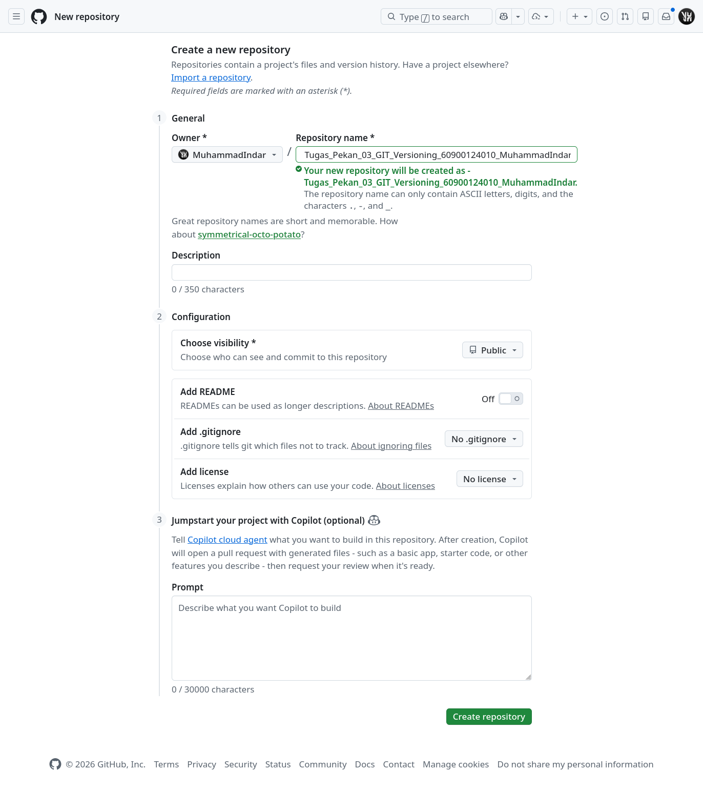

Setelah repository dibuat, GitHub menampilkan halaman repository beserta alamat remote yang akan digunakan oleh project lokal.

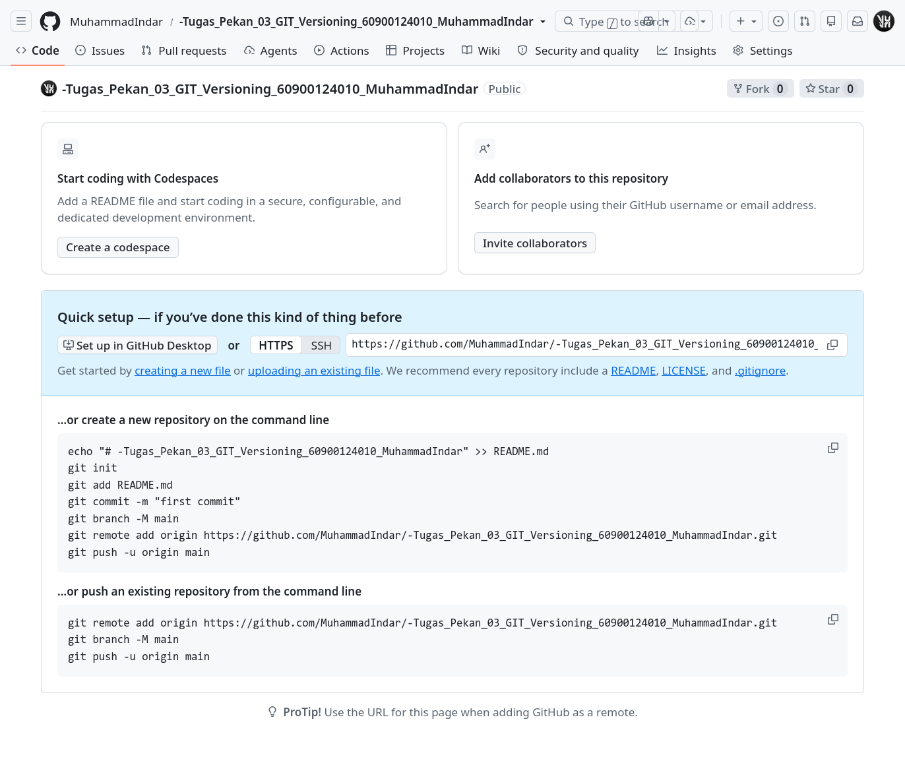

---

## 2. Membuka Project di VS Code dan Terminal

Project kemudian dibuka menggunakan Visual Studio Code dan terminal digunakan untuk menjalankan perintah Git serta setup project.

Direktori project:

```text
~/ShareWindows/Kuliah/Semester 5/Pemrograman Lanjutan/contoh_kode_pekan_5
```

---

## 3. Inisialisasi Git, Branch `main`, Remote, dan Staging

Repository lokal diinisialisasi:

```bash
git init
```

Branch awal kemudian diubah menjadi `main`:

```bash
git branch -M main
```

Remote repository GitHub ditambahkan:

```bash
git remote add origin https://github.com/MuhammadIndar/-Tugas_Pekan_03_GIT_Versioning_60900124010_MuhammadIndar.git
```

Seluruh file project kemudian dimasukkan ke staging area:

```bash
git add .
```

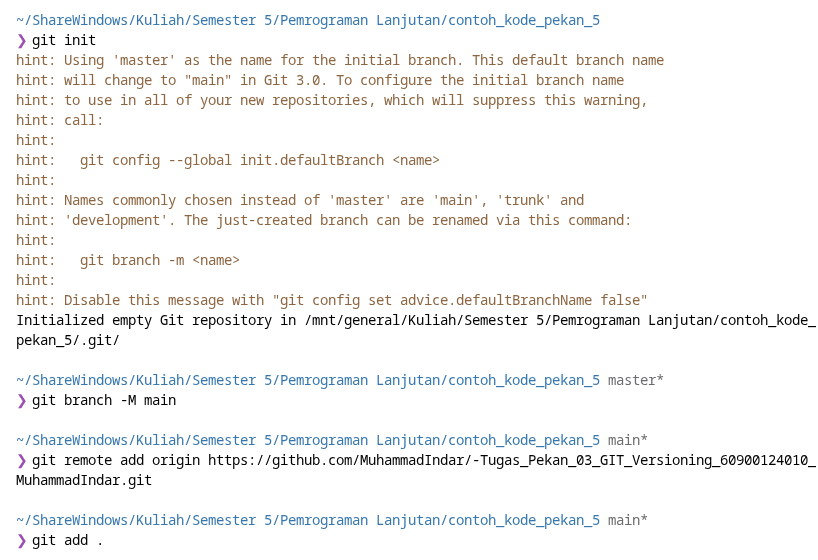

---

## 4. Menyiapkan File `.env`

Sebelum commit awal, template konfigurasi publik disalin menjadi `.env` lokal:

```bash
cp .env.example .env
```

File `.env` digunakan untuk konfigurasi lokal dan tidak diikutsertakan ke repository karena diblokir oleh `.gitignore`.

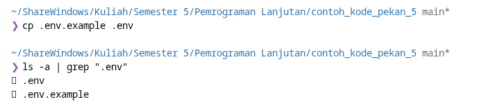

---

## 5. Membuat Commit Awal

Setelah project siap, dibuat commit awal:

```bash
git commit -m "Initial Project"
```

Commit awal berisi struktur dasar project, seperti source code, test, konfigurasi, README, script audit, dan file pendukung lainnya.

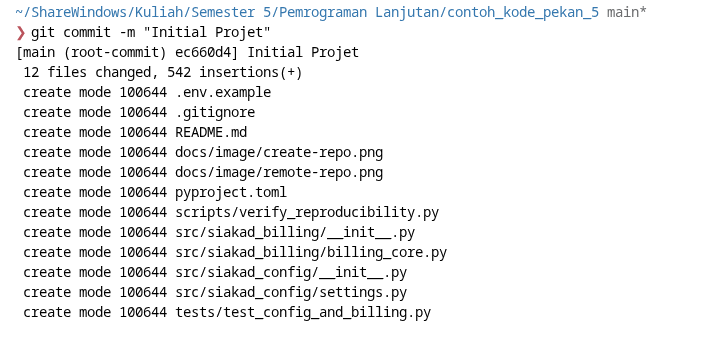

---

## 6. Push Branch `main` ke GitHub

Commit awal dikirim ke GitHub dengan:

```bash
git push -u origin main
```

Perintah tersebut sekaligus menetapkan `origin/main` sebagai upstream branch untuk `main` lokal.

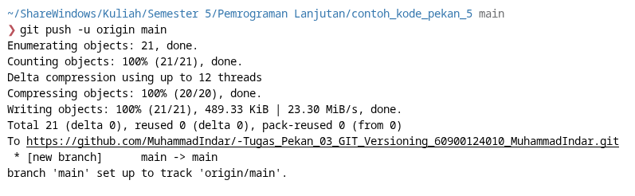

---

## 7. Instalasi Dependency dengan `uv`

Karena project telah memiliki `pyproject.toml`, dependency project dipasang dan environment disiapkan menggunakan:

```bash
uv sync
```

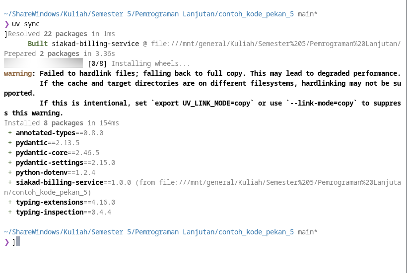

---

## 8. Membuat Feature Branch `feat/billing`

Sebelum menjalankan unit test, pengerjaan dilanjutkan pada feature branch:

```text
feat/billing
```

Branch ini digunakan untuk menampung perubahan dan perbaikan yang nantinya diajukan ke `main` melalui Pull Request.

---

## 9. Menjalankan Unit Test — Percobaan Pertama

Unit test kemudian dijalankan menggunakan:

```bash
uv run python -m unittest tests/test_config_and_billing.py
```

Hasil pertama menunjukkan satu test gagal:

```text
FAIL: test_fail_fast_on_missing_database_url
AssertionError: ValueError not raised
```

Test tersebut berkaitan dengan perilaku **fail-fast** ketika `DATABASE_URL` tidak tersedia.

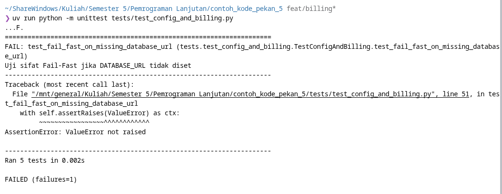

---

## 10. Menjalankan Audit Reproducibility — Percobaan Pertama

Setelah itu dijalankan audit reproducibility:

```bash
uv run python scripts/verify_reproducibility.py
```

Hasil audit pertama:

```text
TOTAL SKOR REPRODUCIBILITY: 75 / 100
PREDIKAT: BAIK (B)
```

Tiga pemeriksaan awal berhasil, sedangkan automated test suite masih gagal.

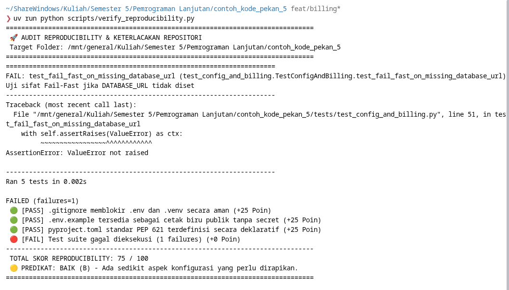

---

## 11. Memperbaiki `tests/test_config_and_billing.py`

Masalah kemudian diperbaiki pada:

```text
tests/test_config_and_billing.py
```

Bagian test fail-fast database URL diperbaiki dengan mengarahkan pemanggilan konfigurasi ke file environment yang tidak tersedia, yaitu:

```python
AppSettings.load_from_env(env_file="nonexistent.env")
```

Tujuannya adalah memastikan kondisi konfigurasi yang hilang menghasilkan `ValueError`, sesuai dengan test yang sedang diverifikasi.

---

## 12. Memperbaiki `tests/test_config_and_billing.py`

Setelah ditemukan kegagalan pada test fail-fast, masalah diperbaiki pada:

```text
tests/test_config_and_billing.py
```

Bagian pengujian diarahkan agar konfigurasi membaca file environment yang tidak tersedia:

```python
with self.assertRaises(ValueError) as ctx:
    AppSettings.load_from_env(
        env_file="nonexistent.env"
    )
```

### Apa itu fail-fast?

**Fail-fast** adalah prinsip bahwa aplikasi atau konfigurasi segera menghasilkan error ketika kondisi wajib tidak terpenuhi, daripada melanjutkan proses dengan konfigurasi yang tidak valid.

Pada kasus ini, test memastikan bahwa ketika file environment yang dibutuhkan tidak tersedia, `AppSettings.load_from_env()` menghasilkan `ValueError`.

---

## 13. Verifikasi Ulang Sebelum Commit dan Push

Setelah perbaikan dilakukan, perubahan **diverifikasi terlebih dahulu**. Ini merupakan urutan workflow yang lebih aman: perubahan tidak seharusnya dipush sebagai perubahan yang dianggap selesai sebelum test dan audit terhadap perubahan tersebut berhasil.

### 13.1 Menjalankan Unit Test

```bash
uv run python -m unittest tests/test_config_and_billing.py
```

Hasil:

```text
Ran 5 tests in 0.002s

OK
```

Artinya seluruh **5 test case** pada test suite tersebut berhasil.

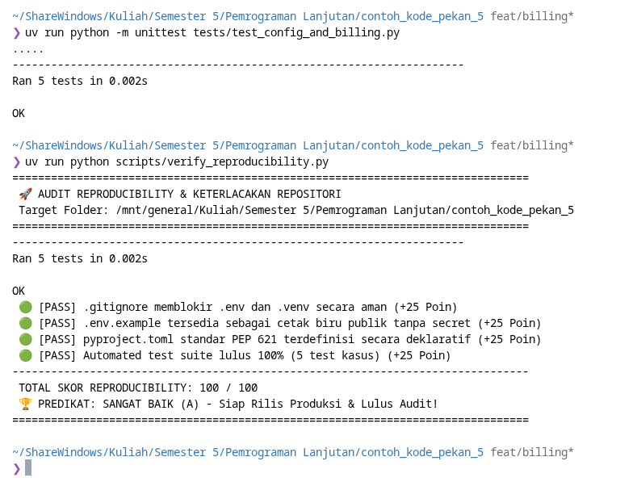

### 13.2 Menjalankan Audit Reproducibility

Setelah unit test lulus, audit reproducibility dijalankan:

```bash
uv run python scripts/verify_reproducibility.py
```

Hasil:

```text
Ran 5 tests in 0.002s

OK

TOTAL SKOR REPRODUCIBILITY: 100 / 100
PREDIKAT: SANGAT BAIK (A) - Siap Rilis Produksi & Lulus Audit!
```

Audit ini berfungsi sebagai pemeriksaan otomatis terhadap aspek reproducibility repository, bukan hanya memastikan satu test tertentu berhasil.


---

## 14. Commit dan Push Perbaikan ke `feat/billing`

Setelah perubahan telah diverifikasi dan test berhasil, perubahan dicatat ke Git.

File yang diperbaiki dimasukkan ke staging:

```bash
git add tests/test_config_and_billing.py
```

Kemudian dibuat commit:

```bash
git commit -m "test(config): perbaiki test fail-fast database url"
```

Commit adalah snapshot perubahan pada repository. Pesan commit digunakan untuk menjelaskan tujuan perubahan secara singkat dan konsisten.

Setelah commit berhasil, perubahan dikirim ke remote feature branch:

```bash
git push origin feat/billing
```

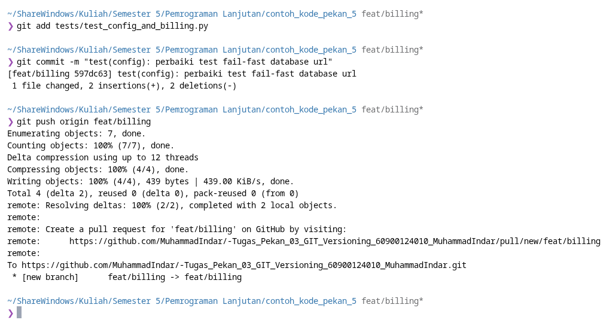

---

## 15. Membuat dan Push Tag `v1.0.0`

Setelah perubahan dinyatakan berhasil dan siap sebagai release, dibuat annotated Git tag:

```bash
git tag -a v1.0.0 -m "Release v1.0.0: Initial reproducible release"
```

Tag adalah penanda permanen pada commit tertentu yang digunakan untuk memberi identitas pada versi release.

Tag kemudian dikirim ke GitHub:

```bash
git push origin v1.0.0
```

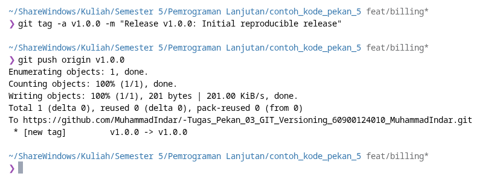

**Catatan workflow:** screenshot menunjukkan tag dibuat saat branch aktif adalah `feat/billing`. Untuk workflow release yang lebih ketat, tag release final sebaiknya menunjuk commit yang sudah berada di `main` setelah Pull Request di-merge. Dokumentasi ini tetap mempertahankan fakta dari proses yang dilakukan.

---

## 16. Menyiapkan Branch Protection untuk `main`

Branch `main` kemudian diberi aturan perlindungan melalui GitHub.

Branch name pattern:

```text
main
```

Pengaturan yang dipilih:

- **Require a pull request before merging**
- **Require approvals**
- Required approvals: `1`
- **Dismiss stale pull request approvals when new commits are pushed**
- **Require approval of the most recent reviewable push**
- **Do not allow bypassing the above settings**

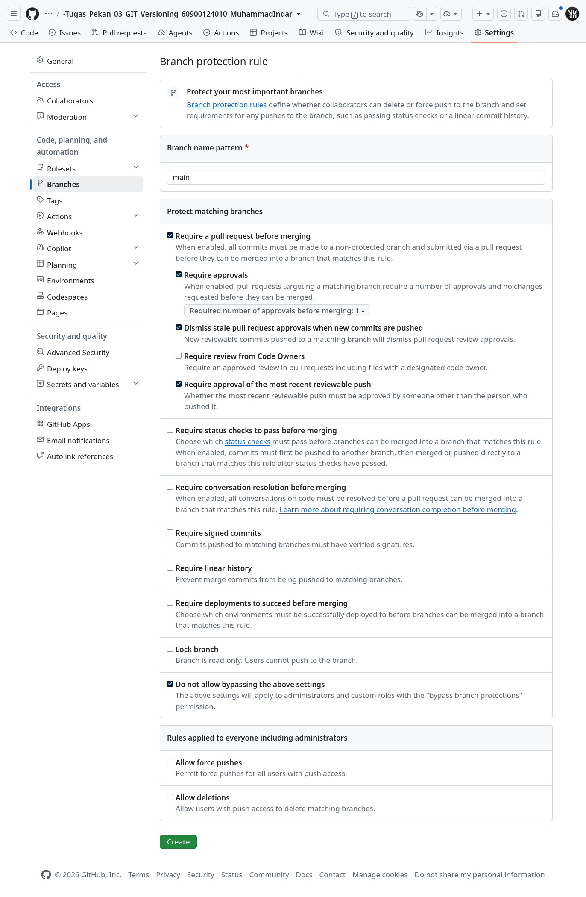

### Apa itu branch protection?

**Branch protection** adalah aturan pada branch tertentu untuk mencegah perubahan masuk secara sembarangan. Pada project ini, `main` diarahkan agar perubahan masuk melalui Pull Request dan membutuhkan approval.

Dengan demikian, `main` berfungsi sebagai branch yang lebih terlindungi, sedangkan pekerjaan perubahan dilakukan pada feature branch.

---

## 17. Membuat Pull Request

Setelah feature branch berisi perubahan yang sudah diverifikasi, dibuat Pull Request dengan konfigurasi:

```text
base: main
compare: feat/billing
```

### Apa itu Pull Request?

**Pull Request (PR)** adalah mekanisme untuk mengusulkan penggabungan perubahan dari satu branch ke branch lain. PR menyediakan tempat untuk melihat perubahan, melakukan review, dan memastikan aturan repository terpenuhi sebelum merge.

GitHub menunjukkan bahwa branch dapat di-merge secara otomatis karena tidak terdapat conflict dengan `main`.

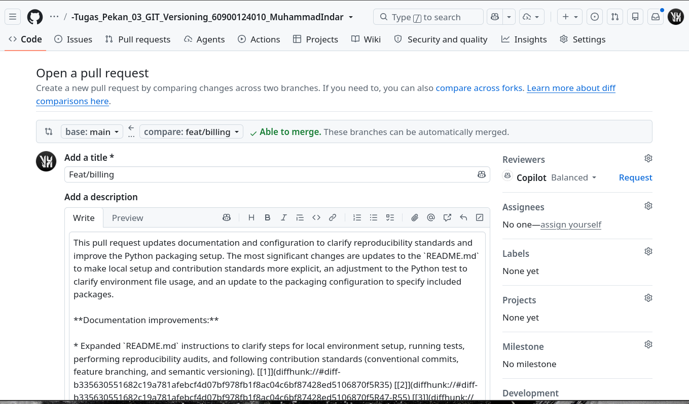

---

## 18. Review Pull Request

Pull Request kemudian diperiksa sebelum merge.

### Apa itu code review?

**Code review** adalah proses memeriksa perubahan kode sebelum perubahan tersebut digabungkan ke branch tujuan. Tujuannya adalah memastikan perubahan sesuai tujuan, tidak menimbulkan masalah yang terlihat, dan memenuhi aturan repository.

Pada Pull Request ini terlihat:

- branch sumber: `feat/billing`
- branch tujuan: `main`
- tidak terdapat merge conflict
- perubahan berasal dari feature branch

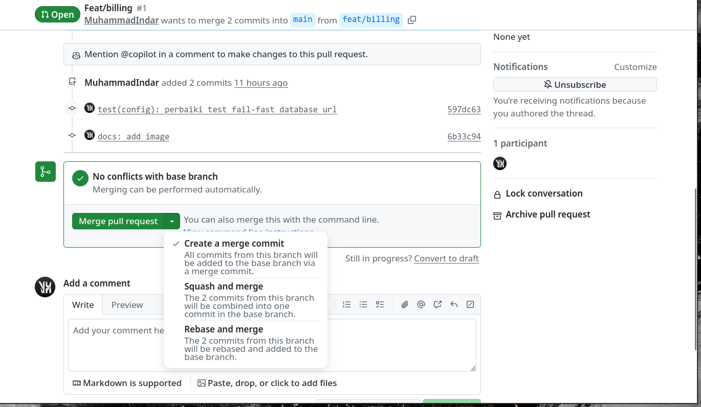

---

## 19. Merge Pull Request ke `main`

Setelah review dan persyaratan Pull Request terpenuhi, perubahan dapat di-merge ke `main`.

### Apa itu merge?

**Merge** adalah proses menggabungkan riwayat perubahan dari feature branch ke branch tujuan.

GitHub menyediakan beberapa strategi merge:

- **Create a merge commit** — membuat commit khusus yang merepresentasikan penggabungan branch.
- **Squash and merge** — menggabungkan beberapa commit dari Pull Request menjadi satu commit pada branch tujuan.
- **Rebase and merge** — menerapkan commit dari feature branch ke atas riwayat branch tujuan tanpa membuat merge commit tambahan.

Pada workflow ini, Pull Request menjadi jalur integrasi perubahan dari:

```text
feat/billing → main
```

---

# ⏱️ Protokol Laboratorium: "The Fresh Clone Test" (5 Menit)

Uji apakah repositori dapat direplikasi oleh rekan tim tanpa galat.

## Langkah 1: Siapkan Konfigurasi Lingkungan Lokal

Salin template konfigurasi publik ke berkas `.env` lokal:

```bash
# Di Windows PowerShell:
Copy-Item .env.example .env

# Di Linux / macOS / Git Bash:
cp .env.example .env
```

## Langkah 2: Jalankan Unit Test Suite

Pastikan seluruh pengujian lulus:

```bash
py -m unittest tests/test_config_and_billing.py
```

## Langkah 3: Jalankan Audit Keterlacakan Otomatis

Jalankan skrip audit mandiri:

```bash
py scripts/verify_reproducibility.py
```

---

# 🛠️ Alur Kerja Git Profesional (Git Workflow)

Gunakan standar ini saat mengerjakan tugas mandiri/kelompok.

## 1. Format Conventional Commits

Gunakan format commit yang menjelaskan jenis dan ruang lingkup perubahan:

```bash
git commit -m "feat(billing): tambah validasi payment api key fail-fast"
git commit -m "test(config): tambah test case invalid port"
git commit -m "chore(deps): perbarui batasan versi pydantic di pyproject.toml"
```

Pada implementasi project ini, commit perbaikan menggunakan:

```bash
git commit -m "test(config): perbaiki test fail-fast database url"
```

---

## 2. Percabangan Fitur (Feature Branch)

Perubahan fitur atau perbaikan dikerjakan pada feature branch, bukan langsung pada `main`.

Contoh dari materi:

```bash
# Buat branch baru untuk fitur diskon
git checkout -b feat/tahfidz-discount

# Setelah selesai dan test lulus, push dan buka Pull Request
git push origin feat/tahfidz-discount
```

Pada project ini, feature branch yang digunakan adalah:

```text
feat/billing
```

Alur aktual:

```text
main
  │
  └── feat/billing
          │
          ├── perbaikan test
          ├── test lulus
          └── Pull Request → main
```

---

## 3. Pemberian Tag Rilis (Semantic Versioning)

Format tag release menggunakan semantic versioning:

```bash
# Berikan tag beranotasi pada rilis v1.0.0
git tag -a v1.0.0 -m "Release v1.0.0: Initial reproducible release"
git push origin v1.0.0
```

Pada pengerjaan ini tag `v1.0.0` memang dibuat dan di-push sebelum Pull Request di-merge. Untuk release final pada workflow produksi, tag sebaiknya menunjuk commit final pada `main`.

---

# Alur Kerja Git Profesional

Urutan workflow yang digunakan untuk dokumentasi proses adalah:

```text
Buat Repository GitHub
        │
        ▼
Buka Project di VS Code + Terminal
        │
        ▼
git init
        │
        ▼
Branch main + remote origin
        │
        ▼
git add .
        │
        ▼
cp .env.example .env
        │
        ▼
git commit "Initial Project"
        │
        ▼
git push -u origin main
        │
        ▼
uv sync
        │
        ▼
Buat branch feat/billing
        │
        ▼
Unit Test → FAIL
        │
        ▼
Audit Reproducibility → 75/100
        │
        ▼
Perbaiki test
        │
        ▼
Unit Test → PASS
        │
        ▼
Audit → 100/100
        │
        ▼
Commit perubahan
        │
        ▼
Push feat/billing
        │
        ▼
Setup Branch Protection main
        │
        ▼
Pull Request feat/billing → main
        │
        ▼
Review
        │
        ▼
Merge → main
```

Urutan tersebut menerapkan prinsip sederhana:

```text
Change
  ↓
Test
  ↓
Audit
  ↓
Commit
  ↓
Push
  ↓
Pull Request
  ↓
Review
  ↓
Merge
```

Dengan pola ini, perubahan yang dikirim ke remote feature branch sudah melalui verifikasi lokal terlebih dahulu.

---

# ✅ Status Akhir

| Tahap                                 | Status          |
| ------------------------------------- | --------------- |
| Repository GitHub                     | ✅              |
| Git repository lokal                  | ✅              |
| Branch`main`                          | ✅              |
| Remote`origin`                        | ✅              |
| `.env` lokal                          | ✅              |
| Initial commit                        | ✅              |
| Push`main`                            | ✅              |
| `uv sync`                             | ✅              |
| Feature branch`feat/billing`          | ✅              |
| Initial unit test                     | ❌ 1 test gagal |
| Initial reproducibility audit         | ⚠️ 75/100       |
| Perbaikan`test_config_and_billing.py` | ✅              |
| Unit test setelah perbaikan           | ✅ 5/5          |
| Reproducibility audit akhir           | ✅ 100/100      |
| Tag`v1.0.0`                           | ✅              |
| Branch protection`main`               | ✅              |
| Pull Request                          | ✅              |
| Review                                | ✅              |
| Merge                                 | ✅              |
